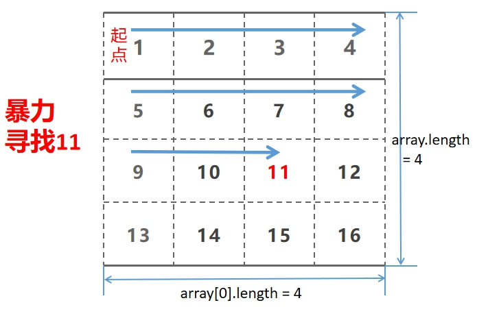
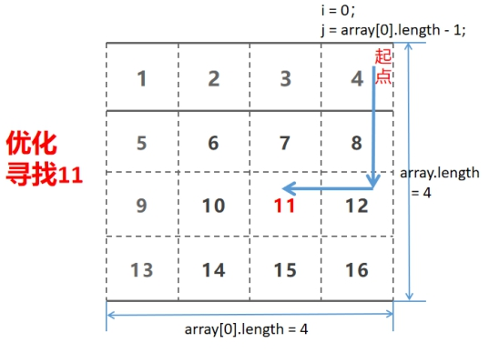

# 剑指offer第一题：二维数组中的查找


## 题目描述

在一个二维数组中（每个一维数组的长度相同），每一行都按照从左到右**递增**的顺序排序，每一列都按照从上到下**递增**的顺序排序。请完成一个函数，输入这样的一个二维数组和一个整数，判断数组中是否含有该整数。

**示例：**

```js
[[1, 2, 3, 4], [5, 6, 7, 8], [9, 10, 11, 12], [13, 14, 15, 16]]
10
20
```

**期望输出结果**

```js
true
false
```


### 解法一：暴力



 ```js
function Find(target, array)
{
    if(array.length == 0 || target == null) return false;
     
    for(let i = 0; i < array.length; i++){
        for(let j = 0; j < array[0].length ; j++){
            if(array[i][j] == target) return true;
        }
    }
    return false;
}
 ```

>  **时间复杂度：O(N<sup>2</sup>)**
>
>  **空间复杂度：O(1)**

### 优化解法二

按照题目要求，每一行都按照从左到右递增的顺序排序，每一列都按照从上到下递增的顺序排序，可以利用这一个特性，根据数据进行查找。

- 在最右列从上到下，找到一个不小于目标的数，再从右到左查找，这个目标要么在这一行，要么没有找到。

 ``` 

```js
function Find(target, array)
{
    if(array.length == 0 || target == null) return false;
     
    let i = 0,
        j = array[0].length - 1;
     
    while(i < array.length && j >= 0){
        if(array[i][j] == target) return true;
        if(array[i][j] > target) j--;
        else i++;
    }
    return false;
}
```

>  **时间复杂度：O(M + N)**（行高+列高）
>
>  **空间复杂度：O(1)**


### 其他解法

跟解法二相同思想，从某一个角落开始，每一次比较就去除一行，直到找到符合的一行，然后在那一行中查找。

下一篇： [02-替换空格](../02-替换空格)