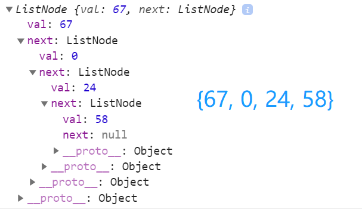
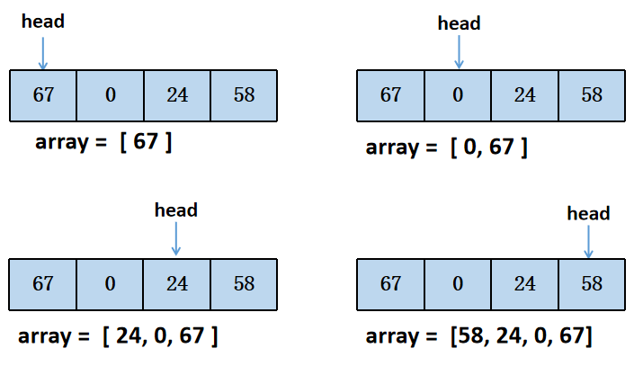

# 剑指offer第三题：从尾到头打印链表

## 题目描述
输入一个链表，按链表从尾到头的顺序返回一个ArrayList。

**示例：**

```js
{67,0,24,58}
```

**期望输出结果**

```js
[58,24,0,67]
```

解释：

这里的链表结构是这样的



为了更好的调试代码，将剑指offer上的注释进行补充

```js
/*function ListNode(x){
    this.val = x;
    this.next = null;
}*/
```


```js
function linkedList() {

    // 封装一个内部类
    function ListNode(x) {
        this.val = x;
        this.next = null;
    }

    // 属性，声明一个链表头和链表的长度
    this.head = null;
    this.length = 0;

    // 一、追溯方法
    linkedList.prototype.append = function (val) {

        // 1、创建新节点
        var newNode = new ListNode(val);

        // 2、判断添加的是否是第一个节点
        if (this.length == 0) { //2.1是第一个节点
            this.head = newNode;
        } else {                 //2.2不是第一个节点
            // 找到最后一个节点
            var current = this.head;
            while (current.next) {
                current = current.next;
            }

            // 最后的节点的Next指向新的节点
            current.next = newNode;
        }

        // 3、长度要加1
        this.length += 1;
    }

    // 二、toString()
    linkedList.prototype.toString = function () {
        // 1、先定义变量
        var current = this.head;
        var listString = '';

        // 将每次遍历的结果组成字符串
        while (current) {
            listString += current.val + ' ';

            // 加完一个元素后，指向下一个元素
            current = current.next;
        }

        // 返回字符串
        return listString;
    }
}
```

为这个链表的创建，我们在这里封装了链表的结构和响应的原型上的插入方法以及重写`toString()`方法

接下来就可以进行编写代码和测试了

```js
// 测试代码
// 创建linkedList
var list = new linkedList();

list.append(67);
list.append(0);
list.append(24);
list.append(58);

console.log(list.toString()); //67 0 24 58 
```


## 解法一：

使用循环的方式，在一个新数组中的前面进行插入（`unshift()`）节点的值。



```js
function printListFromTailToHead(head) {
    var arr = [];
    while (head) {
        arr.unshift(head.val);
        head = head.next;
    }
    return arr;
}
```

## 解法二：

使用循环的方式，在一个新数组中的后面进行插入（`push()`）节点的值，最后将数组翻转。

```js
function printListFromTailToHead_2(head) {
    var arr = [];
    while (head) {
        arr.push(head.val);
        head = head.next;
    }
    return arr.reverse();
}
```

## 解法三：

使用递归的方式。

```js
function printListFromTailToHead_2(head) {
    var array = [];
    if (head != null) {
        array = printListFromTailToHead(head.next);
    }
    array.push(head.val); 
    return array;
}
```


> **时间复杂度：O(n)**
> **空间复杂度：O(n)**