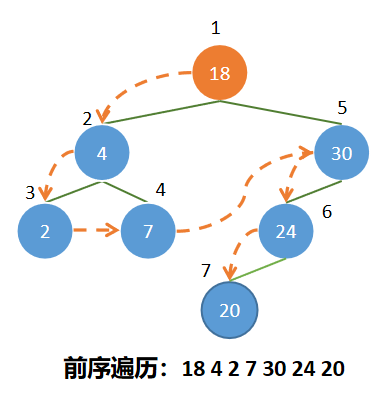
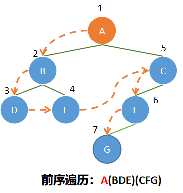
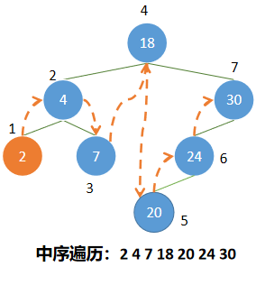
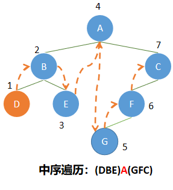
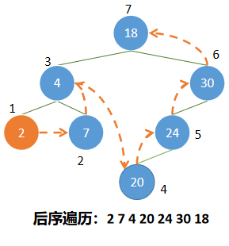
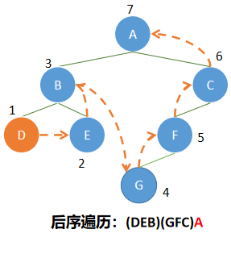
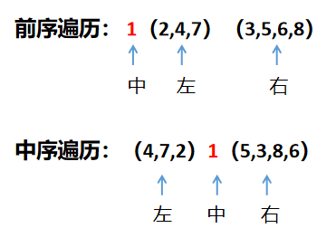

# 剑指offer第四题：重建二叉树

## 题目描述

输入某二叉树的前序遍历和中序遍历的结果，请重建出该二叉树。假设输入的前序遍历和中序遍历的结果中都不重复的数字。例如输入前序遍历序列{1,2,4,7,3,5,6,8}和中序遍历序列{4,7,2,1,5,3,8,6}，则重建二叉树并返回。

## 一、引入二叉树的结构封装

```js
function BinaryTree(){
 
      // 新结点创建的构造函数
      function TreeNode(x){
        this.val = x;
        this.left = null;
        this.right = null;
      }
 
      // 保存根的属性
      this.root = null;
 
      // 创建关于二叉搜索树的相关操作方法
 
}
```


## 二、二叉树的遍历方式

首先在**解题**之前，必须知道什么是前序遍历、中序遍历、后序遍历。想要遍历每一个结点，就必须按照某种特定的顺序进行遍历。

**二叉树常见的方法有三种：**

- 前序遍历（也叫先序遍历）
- 中序遍历
- 后序遍历
- 还有一种不常见的遍历是层次遍历，就是按照树的每一层从上到下从左开始往右遍历。

### 1、前序遍历

操作定义：若二叉树为空，则空操作；否则

（1） 访问根结点；

（2） 先序遍历左子树；

（3） 先序遍历右子树。



**实现代码**

```js
// 前序遍历
BinaryTree.prototype.preOrderTraversal = function(fun){
    // 让preOrderTraversalNode去实现递归操作
    this.preOrderTraversalNode(this.root, fun)
}

// 内部使用
BinaryTree.prototype.preOrderTraversalNode = function(node, fun){

    if (node) {
        // 1、打印当前结点
        fun(node.val);

        // 2、遍历所有的左子树；
        this.preOrderTraversalNode(node.left, fun);

        // 3、遍历所有的右子树。
        this.preOrderTraversalNode(node.right, fun);
    }
}
```

### 2、中序遍历

操作定义：若二叉树为空，则空操作；否则

（1）中序遍历左子树；

（2）访问根结点；

（3）中序遍历右子树。



**代码实现**

```js
// 中序遍历
BinaryTree.prototype.midOrderTraversal = function(fun){
    // 让midOrderTraversalNode去实现递归操作
    this.midOrderTraversal(this.root, fun)
}

// 内部使用
BinaryTree.prototype.midOrderTraversalNode = function(node, fun){

    if (node) {

        // 1、遍历所有的左子树；
        this.midOrderTraversalNode(node.left, fun);

        // 2、打印当前结点
        fun(node.val);

        // 3、遍历所有的右子树。
        this.midOrderTraversalNode(node.right, fun);
    }
}
```

### 3、后序遍历

操作定义：若二叉树为空，则空操作；否则

（1）后序遍历左子树；

（2）后序遍历右子树。

（3）访问根结点；



**代码实现**

```js
// 后序遍历
BinaryTree.prototype.postOrderTraversal = function(fun){
    // 让postOrderTraversalNode去实现递归操作
    this.postOrderTraversalNode(this.root, fun)
}

// 内部使用
BinaryTree.prototype.postOrderTraversalNode = function(node, fun){

    if (node) {

        // 1、遍历所有的左子树；
        this.postOrderTraversalNode(node.left, fun);

        // 2、遍历所有的右子树。
        this.postOrderTraversalNode(node.right, fun);

        // 3、打印当前结点
        fun(node.val);
    }
}
```

## 三、解题

在了解了二叉树的结构和基本遍历方式后，我们就可以知道一些规律，观察三种遍历方式当中的第二张图，再划分题目给出的实例结构。


前序遍历序列

```js
{1,2,4,7,3,5,6,8}
```

中序遍历序列

```js
{4,7,2,1,5,3,8,6}
```



按照这样来拆分结构我们很快就可以知道一个节点的左右节点，然后递归的将节点拆分。

### 递归解答

```js
function reConstructBinaryTree(pre, vin)
{
    // 如果序列个数为0，则返回空
    if(pre.length == 0 || vin.length == 0) return null;
    
    //记录根节点，将前序遍历的第一个作为根节点，shift()方法是用来获取序列中的第一个元素
    var root = new TreeNode(pre.shift());
    //记录根节点的位置
    var index = vin.indexOf(root.val);
    
    //递归地将左右节点找出，slice()方法是将数据拆分成两个部分，分别进行下一次递归。
    root.left = reConstructBinaryTree(pre, vin.slice(0, index));
    root.right = reConstructBinaryTree(pre, vin.slice(index + 1));
    
    return root;
}
```

```js
// 二叉树结构 
//              1  
//           /     \  
//          2       3    
//         /       / \  
//        4       5   6  
//         \         /  
//          7       8  
```

