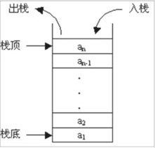
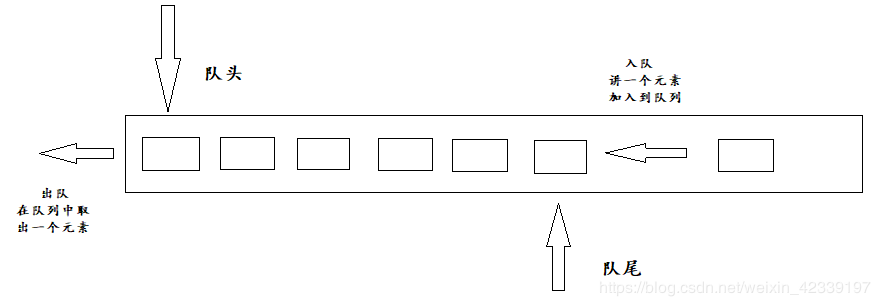
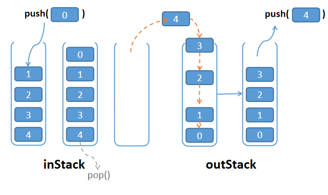

# 剑指offer第五题：用两个栈实现队列


## 题目描述

用两个栈来实现一个队列，完成队列的Push和Pop操作。 队列中的元素为int类型。


## 回顾方法

对于数组的添加和删除操作可以知道有以下方法：

### `push()`

- 在数组最后添加一个元素

```javascript
var arr=[1,2,3,4];
console.log(arr);  //[1, 2, 3, 4]

arr.push(5)  //字符串需添加""，数字则不加
console.log(arr)   //[1, 2, 3, 4, 5]
```

### `pop()`

- 把数组中的最后一位元素提取出来并返回，原数组发生了改变

```javascript
var arr=[1,2,3,4,5];
console.log(arr);  //[1, 2, 3, 4, 5]

var item = arr.pop()  //arr.pop()返回值就是取出的值
console.log(item)   //5
console.log(arr)   //[1, 2, 3, 4]
```

### `shift()`

- 把数组中的第一位元素提取出来并返回，原数组发生了改变

```javascript
var arr=[1,2,3,4,5];
console.log(arr);  //[1, 2, 3, 4, 5]

var item = arr.shift()  //arr.shift()返回值就是取出的值
console.log(item)   //1
console.log(arr)   //[2, 3, 4, 5]
```

### `unshift()`

- 在数组前面添加一个元素

```javascript
var arr=[1,2,3,4,5];
console.log(arr);  //[1, 2, 3, 4, 5]

arr.unshift(0); //字符串需添加""，数字则不加
console.log(arr)   //[0, 1, 2, 3, 4, 5]
```


## 什么是栈？

栈（stack）又名堆栈，它是一种运算受限的线性表。限定仅在表尾进行插入和删除操作的线性表。这一端被称为栈顶，相对地，把另一端称为栈底。向一个栈插入新元素又称作进栈、入栈或压栈，它是把新元素放到栈顶元素的上面，使之成为新的栈顶元素；从一个栈删除元素又称作出栈或退栈，它是把栈顶元素删除掉，使其相邻的元素成为新的栈顶元素。



具体可以查看：[【JS数据结构与算法】栈（Stack）的封装及应用](https://blog.csdn.net/weixin_42339197/article/details/97610931)


## 什么是队列？

队列（Queue）是一种特殊的线性表，先进先出（FIFO，First In First Out）

特殊之处在于它只允许在表的前端（front）进行删除操作，

而在表的后端（rear）进行插入操作，和栈一样，队列是一种操作受限制的线性表。

进行插入操作的端称为队尾，进行删除操作的端称为队头。




具体可以查看：[【JS数据结构与算法】队列（Queue）、队列的封装及其应用](https://blog.csdn.net/weixin_42339197/article/details/97622707)


## 解题

我们可以知道，数组中的pop和push方法实现的方式是只在数组的尾部进行操作，而队列的进出方式是一头进，另一头出，这时候push方法可以不需要变动，虽然使用`shift()`用一个栈可以实现，程序依旧可以通过。

```javascript
var stack = [];
function push(node)
{
    // write code here
    stack.push(node);
}
function pop()
{
    // write code here
    return stack.shift();
}
```

但是题目要求使用两个栈，那我们就定义两个栈呗

```javascript
var inStack = [];
var outStack = [];
function push(node)
{
    // write code here
    inStack.push(node);
}
```

对于pop方法，我们巧妙借助outStack这个栈，实现的目的是，将inStack中的元素倒置放入outStack中，取得outStack栈顶元素，这样就间接地取得了inStack的栈底元素。

### 思路：

- 如果outStack中没有元素，就将inStack中的元素倒置放入outStack中
- 返回outStack的栈顶元素



```javascript
function pop()
{
    // write code here
    if(!outStack.length)
        while(inStack.length) outStack.push(inStack.pop());
    return outStack.pop();
}
```

完整代码

```javascript
var inStack = [];
var outStack = [];
function push(node)
{
    // write code here
    inStack.push(node);
}
function pop()
{
    // write code here
    if(!outStack.length)
        while(inStack.length) outStack.push(inStack.pop());
    return outStack.pop();
}
```

上一篇：[04-重建二叉树](../04-重建二叉树/)

下一篇：[06-旋转数组的最小数字](../06-旋转数组的最小数字/)