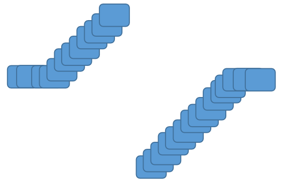
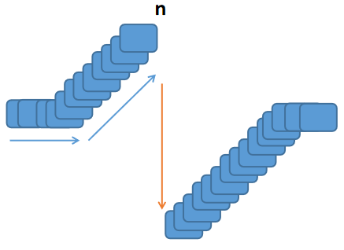
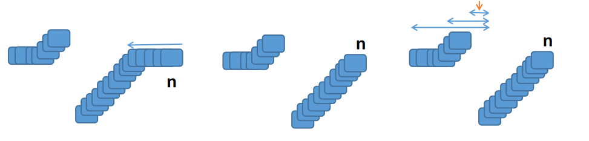

# 剑指offer第六题：旋转数组的最小数字


## 题目描述

把一个数组最开始的若干个元素搬到数组的末尾，我们称之为数组的旋转。输入一个**非递减排序**的数组的一个旋转，输出旋转数组的最小元素。

例如数组{3,4,5,1,2}为{1,2,3,4,5}的一个旋转，该数组的最小值为1。

NOTE：给出的所有元素都大于0，若数组大小为0，请返回0。


### 解题

读题理解：

在一个非递减排序的数组中，那就是递增的排序数组，把一个数组最开始的若干个元素搬到数组的末尾，这时候会形成以下特殊的形态




#### 方法一：暴力解决

如果一路下去出现了非递增序列就停止遍历。

```javascript
function minNumberInRotateArray(rotateArray)
{
    // 给出的所有元素都大于0，若数组大小为0，请返回0。
	if(rotateArray.length == 0) return 0;
    
    var n = 0;
    while(rotateArray[n] <= rotateArray[n + 1]){
        n++;
    }
    
    return rotateArray[n + 1];
}
```



#####  复杂度

> 时间复杂度：O(n)
>
> 空间复杂度：O(1)

#### 方法二：排序得最小值

不管三七二十一将数组升序排序，取得第一个元素则是最小数字。

```javascript
function minNumberInRotateArray(rotateArray)
{
    if(rotateArray.length == 0) return 0;
    
    return rotateArray.sort(
        function(a,b){
            return a-b;
        }
    )[0];
}
```

#####  复杂度

> 时间复杂度：O(nlogn)
>
> 空间复杂度：O(1)


#### 方法三：使用自带方法`Math.min.apply`

JavaScript给我们提供了一个方法，找出数组中最小的数字用`Math.min.apply`。

```javascript
function minNumberInRotateArray(rotateArray)
{
    if(rotateArray.length == 0) return 0;
    
    return Math.min.apply(null,rotateArray);
}
```

#### 方法四：二分查找

在去除后面相同的数据之后，剩下的部分进行二分查找。

```javascript
function minNumberInRotateArray(rotateArray)
{
    var n = rotateArray.length - 1;
    if(n < 0) return 0;
    
    // 去除后面相同的数据
    while(rotateArray[n] == rotateArray[0] && n > 0) n--;
    
    var l = 0, r = n;
    
    // 二分查找剩下的数列
    while(l < r){
        var mid = l + r >> 1;
        if(rotateArray[mid] < rotateArray[0]) r = mid;
        else l = mid + 1;
    }
    
    return rotateArray[r];
}
```




上一篇：[05-用两个栈实现队列](../05-用两个栈实现队列/)

下一篇：[07-斐波那契数列](../07-斐波那契数列/)