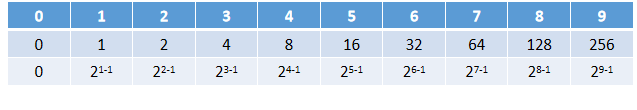

# 剑指offer第九题：变态跳台阶


## 题目描述

一只青蛙一次可以跳上1级台阶，也可以跳上2级。求该青蛙跳上一个n级的台阶总共有多少种跳法（先后次序不同算不同的结果）。


分析结果如下



===================》》》   **2 <sup>(n - 1)</sup>**


## 解法一：pow

```javascript
function jumpFloorII(number)
{
    // write code here
    return number == 0 ? 0 : Math.pow(2, number-1);
}
```


## 解法二：移位运算

```javascript
function jumpFloorII(number)
{
    return number == 0 ? 0 : 1<<(number-1);
}
```


## 解法三：幂运算符（**）

```javascript
function jumpFloorII(number)
{
    return number == 0 ? 0 : 2 ** (number-1);
}
```

上一篇：[08-跳台阶](../08-跳台阶/)

下一篇：[10-矩形覆盖](../10-矩形覆盖/)