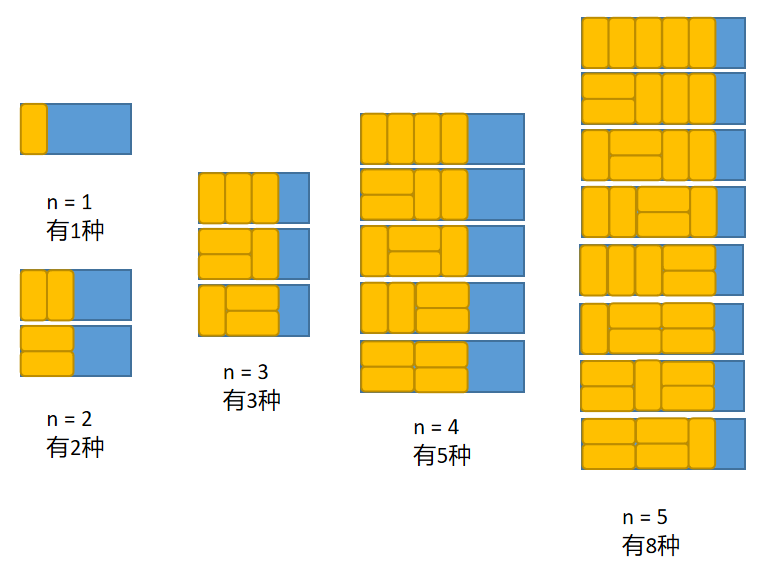

# 剑指offer第十题：矩阵覆盖

## 题目描述

我们可以用2*1的小矩形横着或者竖着去覆盖更大的矩形。请问用n个2*1的小矩形无重叠地覆盖一个2*n的大矩形，总共有多少种方法？

## 解题

思路：斐波那契数列变形题



### 方法一：

```javascript
function rectCover(number)
{
    if(number <= 2) return number;
    return rectCover(number - 1)+ rectCover(number - 2);
}
```


### 方法二：

```javascript
function rectCover(number)
{
    var a = [];
    a[0] = 0;
    a[1] = 1;
    a[2] = 2;
    if(number < 3) return a[number];
    for(var i = 3 ; i <= number ; i++){
        a[i] = a[i - 1]+ a[i - 2];
    }
    return a[number];
}
```


### 方法三：

```javascript
function rectCover(number)
{
    if(number == 0) return 0;
    var a = 0;
    var b = 1;
    while(number-- > 0){
        var t = b;
        b += a;
        a = t;
    }
    return b;
}
```