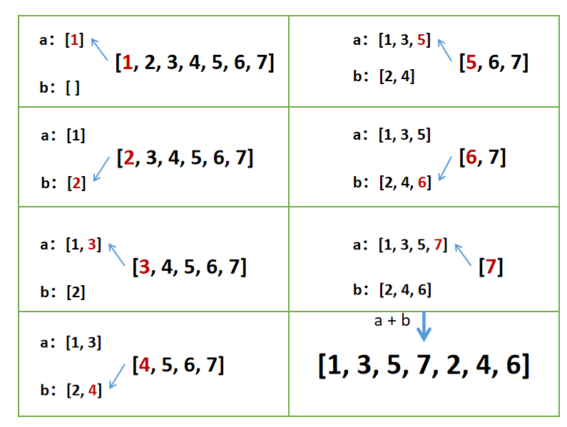
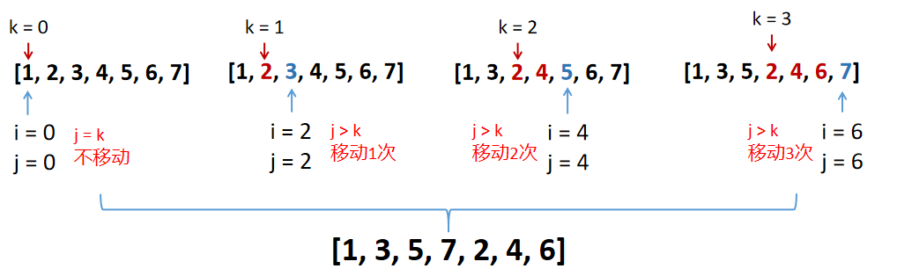

# 剑指offer第13题：调整数组顺序使奇数位于偶数前面

## 题目描述

输入一个整数数组，实现一个函数来调整该数组中数字的顺序，使得所有的奇数位于数组的前半部分，所有的偶数位于数组的后半部分，**并保证奇数和奇数，偶数和偶数之间的相对位置不变**。

## 分析题目

- 返回一个数组
- 数组中的所有奇数位于数组的前半部分
- 数组中的所有的偶数位于数组的后半部分
- 返回的数组与原来的数组中，奇数和奇数，偶数和偶数之间的相对位置不变

## 解题

### 解法一：归并思想

- 首先创建两个数组，一个存放奇数，另一个存放偶数
- 遇到奇数，将奇数放入数组 a 中
- 遇到偶数，将偶数放入数组 b 中
- 返回两个数组 a 和 b 拼接后的结果

```javascript
function reOrderArray(array)
{
    var a = [];
    var b = [];

    for (var i = 0; i < array.length; i++) {
      if(array[i] % 2 !== 0) a.push(array[i]);  // if(array[i] & 1 === 1)
      else b.push(array[i]);
    }

    return [...a,...b];  // 或 a.concat(b)
}
```



> 时间复杂度：O(N)
>
> 空间复杂度： O(N)


### 解法二：移动（插入思想）

为了不改变奇数和奇数，偶数和偶数之间的相对位置，我们联想到，排序的方法中，稳定的方法有：冒泡、插入、归并等。


- 首先一旦查找到奇数，并用 k 记录奇数的位置
- 用 j 来限制当前奇数需要移动的次数（表示奇数前面有多少个偶数）

```javascript
function reOrderArray(array)
{
    var k = 0
    for(var i = 0; i < array.length; i++){
        if(array[i] % 2 == 1){
            var j = i;
            while(j > k){
                var temp = array[j];
                array[j] = array[j - 1];
                array[j - 1] = temp;
                j--;
            }
            k++;
        }
    }
    return array;
}
```



> 时间复杂度：O(N<sup>2</sup>)
>
> 空间复杂度： O(1)

