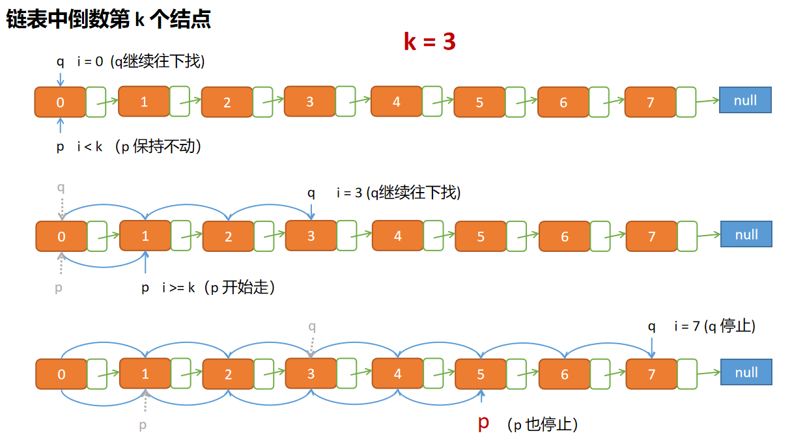

# 剑指offer第14题：链表中倒数第k个结点


## 题目描述

输入一个链表，输出该链表中倒数第k个结点。


## 解题

题目给出的链表，不能够得知链表的长度，如果得到了链表的长度，那么遍历  length - k 就可以得到倒数第 k 个结点

```javascript
/*function ListNode(x){
    this.val = x;
    this.next = null;
}*/
function FindKthToTail(head, k)
{
    if( k > count || k < 0) return ;
    
    var current = head;
    var count = 0;
    while(current){
        count++;
        current = current.next;
    }
    
    current = head;
    for(var i = 0; i < count - k ; i++ ){
        current = current.next;
    }
    
    return current;
}
```

但是这样的时间复杂度就是 O(2N) 而且为了得到链表的长度而去遍历这个链表，就有点浪费。


我们可以借助两个指针，一个先走，另一个走剩下的部分

- 指针 q 是要走完整个链表的，防止指针 p 越界
- 等待指针 q 走了 k 次，指针 p 走剩下的部分，也就是  length - k 的次数，
- 当 q 走到链表末端，p 正好是倒数第 k 个结点
- 如果 k 比 链表长度要大，则是不符合条件的查找



```javascript
/*function ListNode(x){
    this.val = x;
    this.next = null;
}*/
function FindKthToTail(head, k)
{
    var p = head,
        q = head;
    var i = 0;
    while(q !== null){
        if(i >= k) p = p.next;
        q = q.next;
        i++;
    }
    return i < k ? null : p;
}
```

上一篇：[13-调整数组顺序使奇数位于偶数前面](../13-调整数组顺序使奇数位于偶数前面/)

下一篇：[15-反转链表](../15-反转链表/)