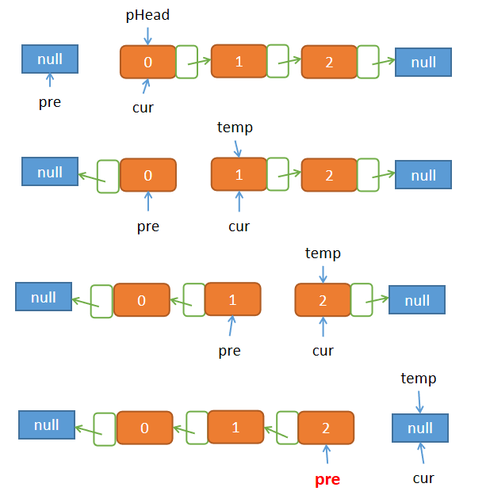

# 剑指offer第15题：反转链表


## 题目描述

输入一个链表，反转链表后，输出新链表的表头。


## 解题

借助三个指针，pre 指向 null，cur 指向 pHead ，temp 记录 cur的下一个结点。

- 执行循环操作，如果当前结点不为空的话，一直执行，空则停止：
  - 先用 temp 保存 cur 的下一个节点的信息，相当于就是 pHead 的下一个结点。保证单链表不会因为失去pHead 节点的原next节点而就此断裂
  - 保存了next结点之后，让cur 从指向next 变成指向 pre 
  - pre 再指向 cur ，实现了一次指针反转
  - 让cur 指向 temp ，实现pre 、temp、cur依次向后移动一个结点，继续下一次的指针反转

- 如果cur为 null 的时候，pre就到了最后一个结点，链表已经反转完毕，如果需要返回反转链表的结果，pre就是反转后链表的第一个节点



```javascript
/*function ListNode(x){
    this.val = x;
    this.next = null;
}*/
function ReverseList(pHead)
{
    var pre = null;
    var cur = pHead;
    
    while(cur !== null){
        var temp = cur.next;
        cur.next = pre;
        pre = cur;
        cur = temp;
    }
    
    return pre;
}
```


上一篇：[14-链表中倒数第k个结点](../14-链表中倒数第k个结点/)

下一篇：[16-合并两个排序的链表](../16-合并两个排序的链表/)