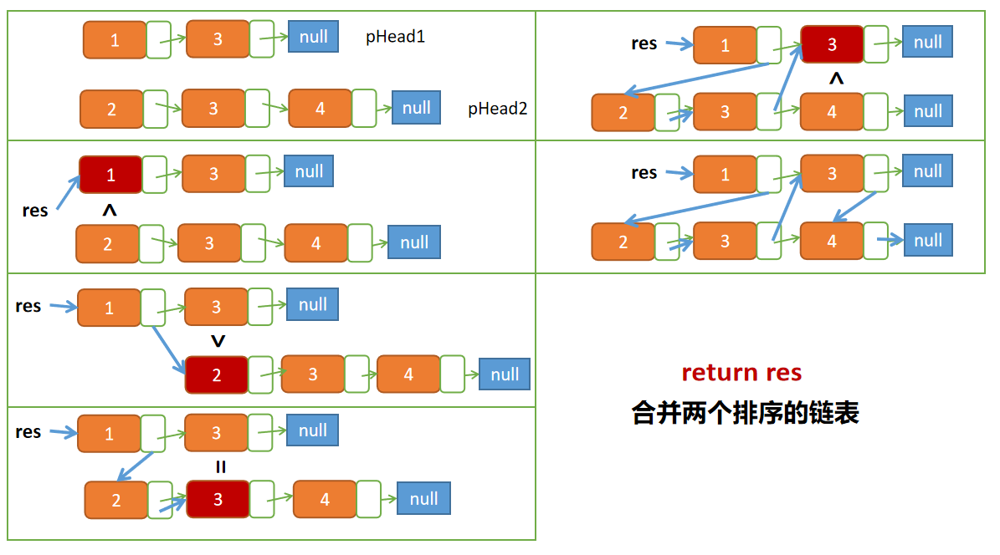

# 剑指offer第16题：合并两个排序的链表


## 题目描述

输入两个单调递增的链表，输出两个链表合成后的链表，当然我们需要合成后的链表满足单调不减规则。


## 解题

### 解法一：递归

如果传入的结点值小的就进入到res链表的下一个结点，终止条件为其中一个链表遍历完毕。



```javascript
/*function ListNode(x){
    this.val = x;
    this.next = null;
}*/
function Merge(pHead1, pHead2)
{
    if(pHead1 == null) return pHead2;
    if(pHead2 == null) return pHead1;
   
    var res = null;
    if(pHead1.val > pHead2.val){
        res = pHead2;
        res.next = Merge(pHead1, pHead2.next);
    }else{
        res = pHead1;
        res.next = Merge(pHead1.next, pHead2);
    }
    
    return res;
}
```


### 解法二：非递归

定义一个结点 newNode ，让 current 指针去完成 next 的指向。

```javascript
/*function ListNode(x){
    this.val = x;
    this.next = null;
}*/
function Merge(pHead1, pHead2)
{
    var newNode = new ListNode();
    var current = newNode;
    
    while(pHead1 != null && pHead2 != null){
        if(pHead1.val < pHead2.val){
            current.next = pHead1;
            pHead1 = pHead1.next;
        }else{
            current.next = pHead2;
            pHead2 = pHead2.next;
        }
        current = current.next;
    }
    
    if(pHead1 != null) current.next = pHead1;
    if(pHead2 != null) current.next = pHead2;
    
    return newNode.next;
}
```

上一篇：[15-反转链表](../15-反转链表/)

下一篇：[17-二叉树的子结构](../17-二叉树的子结构/)