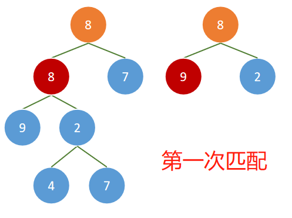
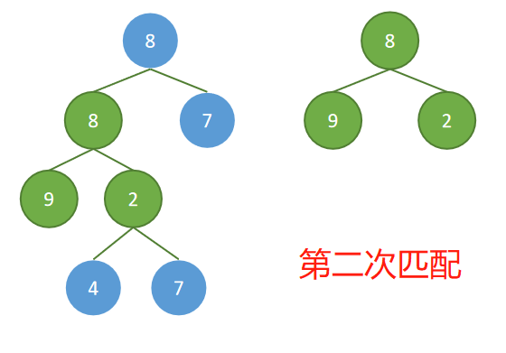
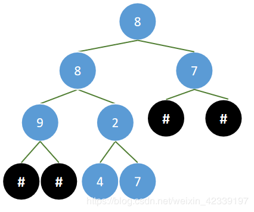
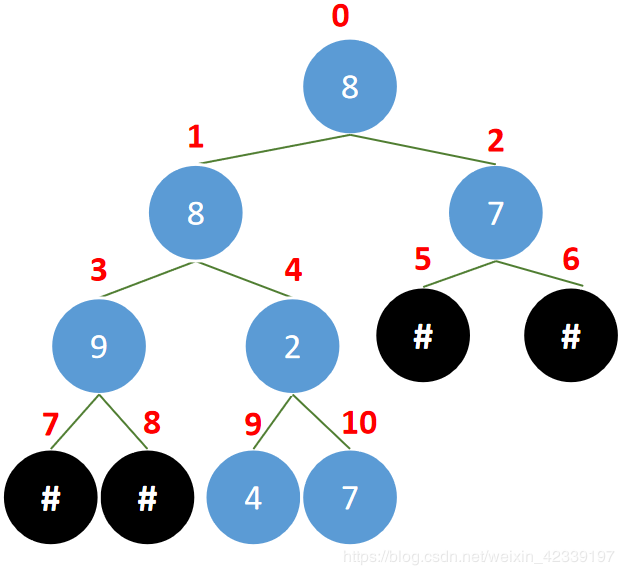
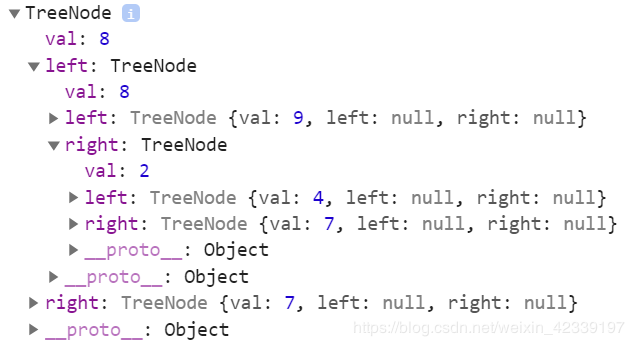

# 剑指offer第17题：二叉树的子结构


## 题目描述

输入两棵二叉树A，B，判断B是不是A的子结构。（ps：我们约定空树不是任意一个树的子结构）

**用例**

```javascript
{8,8,7,9,2,#,#,#,#,4,7},{8,9,2}
```

（最后有补充二叉树的结构）

**对应输出应该为**

```javascript
true
```





## 解析

- 在二叉树 pRoot1 中找到二叉树 pRoot2 的根结点
  - 根据题意，空树不是任意一个树的子结构，还可以说明如果没有寻找到相同的结点，那么就不是子树。
  - 如果找到相同的结点，就调用判断是否是子树的函数
  - 上述没有找到，递归地向二叉树 pRoot1 左子树查找
  - 上述没有找到，递归地向二叉树 pRoot1 右子树查找
- 判断 B 是否是 A 的子树
  - 如果二叉树 B 已经遍历完，说明是二叉树 A 的子树
  - 如果二叉树 A 提前遍历完，说明二叉树 B 不是二叉树 A 的子树
  - 只要期间出现结点不同就立即返回不符合
  - 递归地遍历二叉树 A 和二叉树 B 所有的的结点

**注意**：使用flag标识，作为条件判断中的结点是否继续匹配

```javascript
/* function TreeNode(x) {
    this.val = x;
    this.left = null;
    this.right = null;
} */


//在二叉树 pRoot1 中找到二叉树 pRoot2 的根结点
function HasSubtree(pRoot1, pRoot2)
{
    if(pRoot1 == null || pRoot2 == null) return false;   //根据题意，空树不是任意一个树的子结构，还可以说明如果没有寻找到相同的结点，那么就不是子树。
    var flag = false;  
    if(pRoot1.val == pRoot2.val) flag = isHasSubtree(pRoot1, pRoot2); // 如果找到相同的结点，就调用判断是否是子树的函数
    if(!flag) flag = HasSubtree(pRoot1.left, pRoot2);  // 上述没有找到，向二叉树 pRoot1 左子树查找
    if(!flag) flag = HasSubtree(pRoot1.right, pRoot2);  // 上述没有找到，向二叉树 pRoot1 右子树查找
    return flag;
}

//这里判断 B 是否是 A 的子树
function isHasSubtree(A, B){
    if(B == null)return true; // 如果二叉树 B 已经遍历完，说明是二叉树 A 的子树
    if(A == null)return false; //如果二叉树 A 提前遍历完，说明二叉树 B 不是二叉树 A 的子树
    if(A.val != B.val) return false; // 只要期间出现结点不同就立即返回不符合
    return isHasSubtree(A.left, B.left) && isHasSubtree(A.right, B.right);  // 遍历二叉树 A 和二叉树 B 所有的的结点
}
```


## 层次遍历结果的二叉树结构

### 前言
为了实现二叉树的有关操作，我们必须要创建出二叉树结构，而不是单纯的使用数组或者是题目给出的用例；
**用例：**

```javascript
{8,8,7,9,2,#,#,#,#,4,7},{8,9,2}
```

根据用例给出了二叉树的各个元素，但是具体的结构却没有，解题的之前，我们需要了解树的结构是怎么样
 `{8,8,7,9,2,#,#,#,#,4,7}` 其实是二叉树**层次遍历后的结果**，`#`表示的是空节点。最终的结构就会是以下这样的：


对于数组 `[8,8,7,9,2,#,#,#,#,4,7]` ，我们为二叉树的结构标上数组的对应下标

不难看出如果将 `#`加上，那就是一个**完全二叉树**，根据左右节点的数组下标值，我们可以得出一个规律

- 如果当前节点对应的数组下标值为 index
- 当前节点的左节点   ----->>  index *  2  + 1
- 当前节点的右节点   ----->>  index *  2  + 2

构建思路：
- 传入数组的第一个元素，如果不为  `#`（空），将该元素作为根节点
- 根节点的左子节点递归地传入 `index *  2  + 1`
- 根节点的左子节点递归地传入 `index *  2  + 2`
- 如果传入的 index 值大于等于数组长度，则返回根节点，即创建出来的二叉树

```javascript
 function TreeNode(val) {
     this.val = val;
     this.left = null;
     this.right = null;
 }

 function create(index, data) {
     var p = null;
     if (index >= data.length)  return p;
     if (data[index] != '#') {
         p = new TreeNode(data[index]);
         p.left = create(index * 2 + 1, data);
         p.right = create(index * 2 + 2, data);
     }
     return p;
 }
```

测试代码
```javascript
 var arr = [8, 8, 7, 9, 2, '#', '#', '#', '#', 4, 7];
 var tree = create(0, arr);
 console.log(tree)
```
最终的结构：



上一篇：[16-合并两个排序的链表](../16-合并两个排序的链表/)

下一篇：[18-二叉树的镜像](../18-二叉树的镜像/)