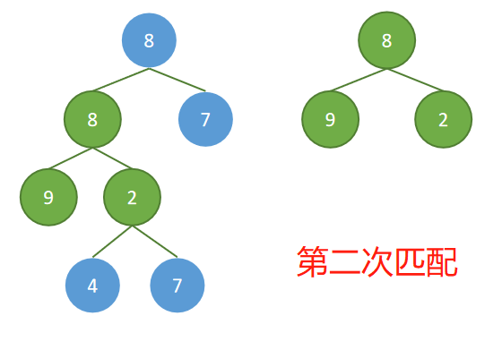

# 剑指offer第17题：树的子结构


## 题目描述

输入两棵二叉树A，B，判断B是不是A的子结构。（ps：我们约定空树不是任意一个树的子结构）

**用例**

```javascript
{8,8,7,9,2,#,#,#,#,4,7},{8,9,2}
```


**对应输出应该为**

```javascript
true
```




## 解析

- 在二叉树 pRoot1 中找到二叉树 pRoot2 的根结点
  - 根据题意，空树不是任意一个树的子结构，还可以说明如果没有寻找到相同的结点，那么就不是子树。
  - 如果找到相同的结点，就调用判断是否是子树的函数
  - 上述没有找到，递归地向二叉树 pRoot1 左子树查找
  - 上述没有找到，递归地向二叉树 pRoot1 右子树查找
- 判断 B 是否是 A 的子树
  - 如果二叉树 B 已经遍历完，说明是二叉树 A 的子树
  - 如果二叉树 A 提前遍历完，说明二叉树 B 不是二叉树 A 的子树
  - 只要期间出现结点不同就立即返回不符合
  - 递归地遍历二叉树 A 和二叉树 B 所有的的结点

**注意**：使用flag标识，作为条件判断中的结点是否继续匹配

```javascript
/* function TreeNode(x) {
    this.val = x;
    this.left = null;
    this.right = null;
} */


//在二叉树 pRoot1 中找到二叉树 pRoot2 的根结点
function HasSubtree(pRoot1, pRoot2)
{
    if(pRoot1 == null || pRoot2 == null) return false;   //根据题意，空树不是任意一个树的子结构，还可以说明如果没有寻找到相同的结点，那么就不是子树。
    var flag = false;  
    if(pRoot1.val == pRoot2.val) flag = isHasSubtree(pRoot1, pRoot2); // 如果找到相同的结点，就调用判断是否是子树的函数
    if(!flag) flag = HasSubtree(pRoot1.left, pRoot2);  // 上述没有找到，向二叉树 pRoot1 左子树查找
    if(!flag) flag = HasSubtree(pRoot1.right, pRoot2);  // 上述没有找到，向二叉树 pRoot1 右子树查找
    return flag;
}

//这里判断 B 是否是 A 的子树
function isHasSubtree(A, B){
    if(B == null)return true; // 如果二叉树 B 已经遍历完，说明是二叉树 A 的子树
    if(A == null)return false; //如果二叉树 A 提前遍历完，说明二叉树 B 不是二叉树 A 的子树
    if(A.val != B.val) return false; // 只要期间出现结点不同就立即返回不符合
    return isHasSubtree(A.left, B.left) && isHasSubtree(A.right, B.right);  // 遍历二叉树 A 和二叉树 B 所有的的结点
}
```

