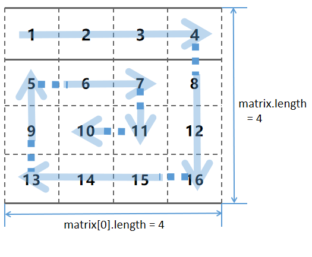
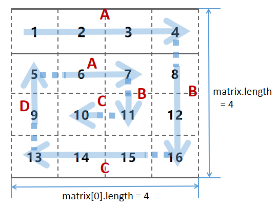
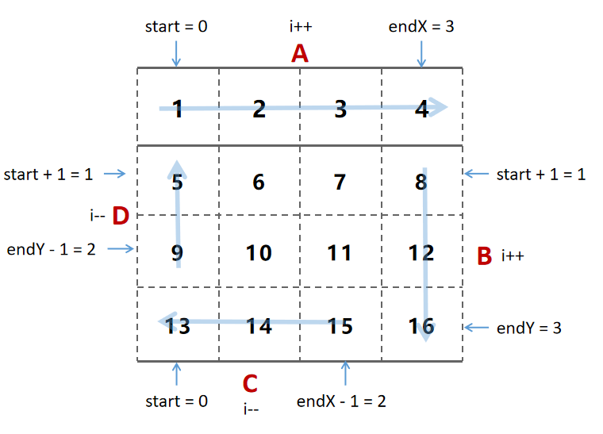

# 剑指offer第19题：顺时针打印矩阵


## 题目描述

输入一个矩阵，按照从外向里以顺时针的顺序依次打印出每一个数字，例如，如果输入如下4 X 4矩阵： 1 2 3 4 5 6 7 8 9 10 11 12 13 14 15 16 则依次打印出数字 1,2,3,4,8,12,16,15,14,13,9,5,6,7,11,10.


## 分析

按照题目的要求，顺时针打印的走法如下图所示。

矩阵，是线性代数中的基本概念之一。一个 `m×n` 的矩阵就是 `m×n` 个数排成 m 行 n 列的一个数阵。

对于一个算法矩阵，可以得知它的行和列数

- `m（行数） =  matrix.length`
- `n（列数） =  matrix[0].length`



每一次行或列的遍历，其实都是有左右边界的，而这个边界，我们可以在左右或者上下的地方通过设置去限制它。


## 解题

### 解法一



上面的图可以看到，一个圈有四条路线，一条路线表示一次行或列的遍历， 4 x 4 的矩阵中，有一个圈 + 三次行或列的遍历。

**路线命名**

- A（从左到右）
- B（从上到下）
- C（从右到左）
- D（从下到上）

**声明变量**

- rows （行，辅助 endY 的计算）
- cols  （列，辅助 endX 的计算）
- start（每一个圈开始的位置`（start, start）`，一次转圈的结束就 **加1** ）
- endX（控制路线 A 的**终点**和路线 C 的**起点**，每完成一个圈就通过 `cols - 1 - start` 计算得出）
- endY（控制路线 B 的**终点**和路线 D 的**起点**，每完成一个圈就通过 `rows - 1 - start` 计算得出）
- result（最后需要返回的数组，通过循环使用 push 方法进行插入元素）

**遍历结束条件**

因为每一个圈都是矩阵的中心圈，圈开始的位置是`（start, start）`，所以对称地将矩阵进行遍历，所以结束条件需要以开始位置的两倍不能大于行和列之间最小的数。

- 当矩阵的 `m（行）>=  n（列）`，这时候的限制条件是列数 ,需要满足  ——>  `cols > start * 2 `
- 当矩阵的 `m（行） <  n（列）`，这时候的限制条件是行数 ,需要满足  ——>  `rows > start * 2 `


#### 路线 A ：从左到右打印一行

```javascript
for (var i = start; i <= endX; i++) {
    result.push(matrix[start][i]);
}
```

-  start 代表当前遍历所在**行**，保持不变
- 从`(start, start)`开始，`(start, endX)`结束
- 使用 i 往右（i++）向 result 数组添加 `matrix[start][i]`


#### 路线B：从上到下打印一行

```javascript
if (start < endY) {
    for (var i = start + 1; i <= endY; i++) {
        result.push(matrix[i][endX]);
    }
}
```

- start < endY
- endX 表示当前遍历的**列**，保持不变
- 从`(start + 1, endX)`开始，`(endY, endX)`结束
- 使用 i 往下（i++）向 result 数组添加 `matrix[i][endX]`


#### 路线C：从右往左打印一行

```javascript
if (start < endX && start < endY) {
    for (var i = endX - 1; i >= start; i--) {
        result.push(matrix[endY][i]);
    }
}
```

- start 不能超过 endX 和 endY
- endY 表示当前遍历的**行**，保持不变
- 从`(endY, endX - 1)`开始，`(endY, start)`结束
- 使用 i 往左（i--）向 result 数组添加 `matrix[endY][i]`


#### 路线D：从下往上打印一行

```javascript
if (start < endX && start < endY - 1) {
    for (var i = endY - 1; i >= start + 1; i--) {
        result.push(matrix[i][start]);
    }
}
```

- start 不能超过 endX 和 endY - 1（endY - 1是因为路线 C 中遍历了圈中左下角的元素）
- start 表示当前遍历的**列**，保持不变
- 从`(endY - 1, start)`开始，`(start + 1, start)`结束
- 使用 i 往上（i--）向 result 数组添加 `matrix[i][start]`



经过一轮后

```javascript
start++
```

最后

```javascript
return result;
```


#### 完整代码

```javascript
function printMatrix(matrix)
{
    // write code here
    if (matrix == null || matrix.length == 0) {
        return [];
    }
    var rows = matrix.length;
    var cols = matrix[0].length;
    var start = 0;
    var result = [];

    while (cols > start * 2 && rows > start * 2) {
        var endX = cols - 1 - start;
        var endY = rows - 1 - start;
        
        //从左到右打印一行
        for (let i = start; i <= endX; i++) {
            result.push(matrix[start][i]);
        }
        //从上到下打印一行
        if (start < endY) {
            for (let i = start + 1; i <= endY; i++) {
                result.push(matrix[i][endX]);
            }
        }
        //从右到左打印一行
        if (start < endX && start < endY) {
            for (let i = endX - 1; i >= start; i--) {
                result.push(matrix[endY][i]);
            }
        }
        //从下到上打印一行
        if (start < endX && start < endY - 1) {
            for (let i = endY - 1; i >= start + 1; i--) {
                result.push(matrix[i][start]);
            }
        }
        start++;
    }
    return result;
}
```


### 解法二

思路相同

```javascript
function printMatrix_2(matrix) {
    var rows = matrix.length;
    var cols = matrix[0].length;
    var result = [];

    if (rows == 0 || cols == 0) return result;
    var top = 0, left = 0, right = cols - 1, bottom = rows - 1;
    while (top <= bottom && left <= right) {
        
        //left to right
        for (let i = left; i <= right; ++i) 
            result.push(matrix[top][i]);
        
        //top tp bottom
        for (let i = top + 1; i <= bottom; ++i) 
            result.push(matrix[i][right]);
        
        //right to left
        for (let i = right - 1; i >= left && top < bottom; --i) 
            result.push(matrix[bottom][i]);
        
        //bottom to top
        for (let i = bottom - 1; i > top && right > left; --i) 
            result.push(matrix[i][left]);
        
        ++top; ++left; --right; --bottom;
    }
    return result;
}
```

上一篇：[18-二叉树的镜像](../18-二叉树的镜像/)

下一篇：[20-包含min函数的栈](../20-包含min函数的栈/)