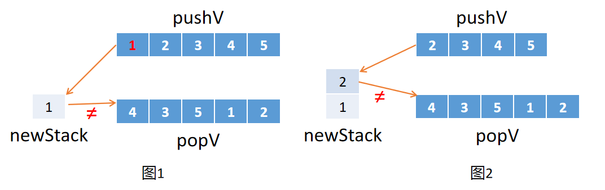
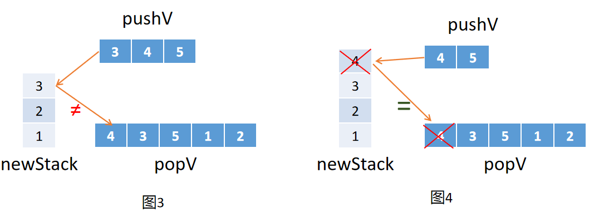
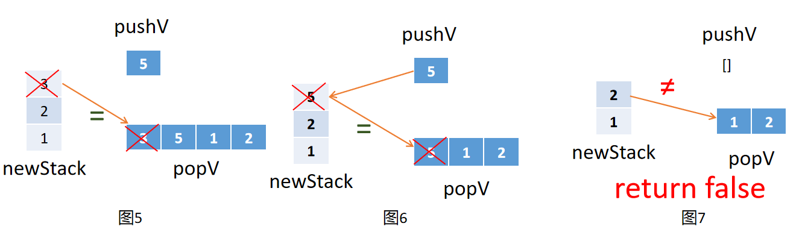

# 剑指offer第21题：栈的压入、弹出序列


## 题目描述

输入两个整数序列，第一个序列表示栈的压入顺序，请判断第二个序列是否可能为该栈的弹出顺序。假设压入栈的所有数字均不相等。例如序列1,2,3,4,5是某栈的压入顺序，序列4,5,3,2,1是该压栈序列对应的一个弹出序列，但4,3,5,1,2就不可能是该压栈序列的弹出序列。（注意：这两个序列的长度是相等的）


## 分析思路

- 创建一个新的数组 newStack 作为栈。

- 将 pushV 中的元素一个一个往新栈放入。

- 如果新栈的栈顶元素与 popV 中的第一个元素相同，则这两个元素出栈。

- 最后的 newStack 元素全部出栈就说明是该压栈序列的弹出序列。

举例子：

```javascript
[1,2,3,4,5],[4,3,5,1,2]
```




- 一开始 newStack 为空，pushV 的第一个元素压入到 newStack 栈中，同时 pushV 的第一个元素移出
- 匹配 newStack 栈顶元素 1 和 popV 的栈底元素 4 ，不相同
- 进行第二次匹配



- 再下一轮匹配
- 进入图4 ，匹配到 newStack 栈顶元素 4 和 popV 的栈底元素 4 相同，两个元素移出



- 进入图5 ，匹配到 newStack 栈顶元素 3 和 popV 的栈底元素 3 相同，两个元素移出
- 进入图6 ，匹配到 newStack 栈顶元素 5 和 popV 的栈底元素 5 相同，两个元素移出
- 进入图7，发现 pushV 为空，newStack 栈顶元素和 popV 的栈底元素不相同，无法继续移出，返回结果 false


## 解题

### 解法一：消除法

```javascript
function IsPopOrder(pushV, popV)
{
    if(pushV.length != popV.length) return false;
    //创建一个新的数组作为栈
    var newStack = [];
    while(pushV.length != 0){
        //将pushV中的元素一个一个往新栈放入
        newStack.push(pushV.shift());
        //如果新栈的栈顶元素与popV中的第一个元素相同，则这两个元素出栈。
        while(newStack.length != 0 && newStack[newStack.length - 1] == popV[0]){
            popV.shift();
            newStack.pop();
        }
    }
    //最后的newStack元素全部出栈就符合
    return newStack.length == 0;
}
```


### 解法二：j 指针匹配

```javascript
function IsPopOrder(pushV, popV){
    if(pushV.length != popV.length) return false;
    var newStack = [];
    for(var i = 0, j = 0; i < pushV.size();){
        //将pushV中的元素一个一个往新栈放入
        newStack.push(pushV[i++]);
        //通过 j 这个指针移动记录匹配元素
        while(j < popV.length && newStack[newStack.length - 1] == popV[j]){
            newStack.pop()
            j++;
        }
    }
    
    return newStack.length == 0;
}
```

