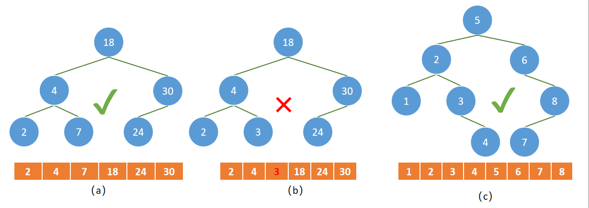
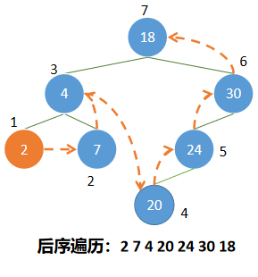
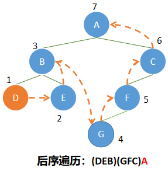

# 剑指offer第23题：二叉搜索树的后序遍历序列

## 题目描述

输入一个整数数组，判断该数组是不是某二叉搜索树的后序遍历的结果。如果是则输出Yes,否则输出No。假设输入的数组的任意两个数字都互不相同。


## 回顾二叉搜索树

二叉搜索树（BST ， Binary Search Tree），也称为二叉排序树或二叉查找树。二叉搜索树是一棵二叉树，也是可以为空。

如果二叉搜索树不为空，那么，满足以下条件：

- 非空左子树的所有键值小于其根节点的键值。
- 非空右子树的所有键值大于其根节点的键值。
- 左右子树本身也是二叉搜索树。



二叉树的后序遍历

操作定义：若二叉树为空，则空操作；否则

（1）后序遍历左子树；

（2）后序遍历右子树。

（3）访问根结点；



按照二叉树的后序遍历，我们可以知道，最后一个元素就是整棵二叉树的根节点，而前半部分则是比最后一个元素小的数，后半部分都是比最后一个元素大的元素

- 取最后一个元素为标记，剩下部分分两半部分，前半部分都小于标记，后半部分都大于标记
- 定义指针 i ，向右移动
- 一轮下来，i 如果能够走到 标记处，则取左边一个元素作为标记
- 重复上面操作，期间如果出现 i 不能够走到 标记处，则说明该数组不是某二叉搜索树的后序遍历的结果

## 解题

```javascript
function VerifySquenceOfBST(sequence)
{
    // write code here
    var length = sequence.length;
    if(length == 0) return false;
    
    var i = 0;
    
    while(--length){
        
        while(sequence[i] < sequence[length]) i++;
        while(sequence[i] > sequence[length]) i++;
        
        if(i < length) return false;
        i = 0;
    }
    return true;
}
```
上一篇：[22-从上往下打印二叉树](../22-从上往下打印二叉树/)

下一篇：[24-二叉树中和为某一值的路径](../24-二叉树中和为某一值的路径/)

