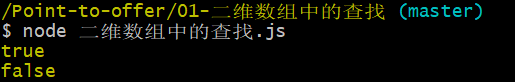
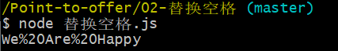

# 剑指Offer解题——JavaScript

>  **本次学习是对剑指offer的解题，多种方法实现，语言使用的是JavaScript。记录自己的学习，也希望帮助需要的学者，如果有错误的地方或者有更好的解决方法，请大家多多指教，谢谢！**

## 引导

读者可以通过阅读对应题目的解法，在[牛客网-在线编程-剑指offer](https://www.nowcoder.com/ta/coding-interviews)上进行测试并提交学习，也可以将代码克隆下来。

```b
git clone https://github.com/hcq29/Point-to-offer.git
```

得到文件后，进入对应的题目，可以直接点击`.html`文件在浏览器的控制台进行查看并调试，也可以通过本地的`node.js`进行代码的执行，方便学习。

```b
node xxxx.js
```





## 题库

下面是对应题目的详解，点击对应的题目即可进入。

| 考点          |                             解题                             |
| :------------ | :----------------------------------------------------------: |
| 数组          |        [01-二维数组中的查找](./01-二维数组中的查找/)         |
| 字符串        |                [02-替换空格](./02-替换空格/)                 |
| 链表          |        [03-从尾到头打印链表](./03-从尾到头打印链表/)         |
| 树            |              [04-重建二叉树](./04-重建二叉树/)               |
| 栈和队列      |        [05-用两个栈实现队列](./05-用两个栈实现队列/)         |
| 查找和排序    |      [06-旋转数组的最小数字](./06-旋转数组的最小数字/)       |
| 递归和循环    |             [07-斐波那契数列](./07-斐波那契数列/)             |
| 递归和循环    |                   [08-跳台阶](./08-跳台阶/)                   |
| 递归和循环    |               [09-变态跳台阶](./09-变态跳台阶/)               |
| 递归和循环    |                 [10-矩形覆盖](./10-矩形覆盖/)                 |
| 位运算        |          [11-二进制中1的个数](./11-二进制中1的个数/)          |
| 代码的完整性  |           [12-数值的整数次方](./12-数值的整数次方/)           |
| 代码的完整性  | [13-调整数组顺序使奇数位于偶数前面](./13-调整数组顺序使奇数位于偶数前面/) |
| 代码的鲁棒性  |      [14-链表中倒数第k个结点](./14-链表中倒数第k个结点/)      |
| 代码的鲁棒性  |                 [15-反转链表](./15-反转链表/)                 |
| 代码的鲁棒性  |       [16-合并两个排序的链表](./16-合并两个排序的链表/)       |
| 代码的鲁棒性  |               [17-二叉树的子结构](./17-二叉树的子结构/)               |
| 面试思路      |             [18-二叉树的镜像](./18-二叉树的镜像/)             |
| 画图让抽象形象化 |          [19-顺时针打印矩阵](./19-顺时针打印矩阵/)          |
| 举例让抽象具体化 | [20-包含min函数的栈](./20-包含min函数的栈/) |
| 持续更新中... |                        持续更新中...                         |
|               |                                                              |

