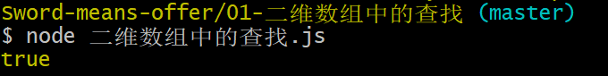

# 剑指Offer解题——JavaScript

>  **本次学习是对剑指offer的解题，多种方法实现，语言使用的是JavaScript。记录自己的学习，也希望帮助需要的学者，如果有错误的地方或者有更好的解决方法，请大家多多指教，谢谢！**

## 引导

读者可以通过阅读对应题目的解法，在[牛客网-在线编程-剑指offer](https://www.nowcoder.com/ta/coding-interviews)上进行测试并提交学习，也可以将代码克隆下来。

```b
git clone https://github.com/hcq29/Sword-means-offer.git
```

得到文件后，进入对应的题目，可以直接点击`.html`文件在浏览器的控制台进行查看并调试，也可以通过本地的`node.js`进行代码的执行，方便学习。

```b
node xxxx.js
```




## 题库

下面是对应题目的详解，点击对应的题目即可进入。

| 考点          |                    解题                    |
| :------------ | :----------------------------------------: |
| 数组          | [二维数组中的查找](./01-二维数组中的查找/) |
| 字符串        |         [替换空格](./02-替换空格/)         |
| 链表          | [从尾到头打印链表](./03-从尾到头打印链表/) |
| 树            |       [重建二叉树](./04-重建二叉树/)       |
| 持续更新中... |               持续更新中...                |
|               |                                            |

